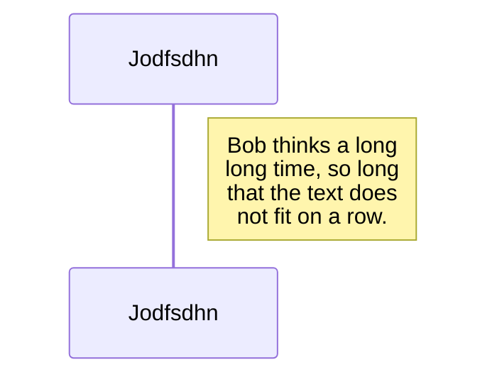
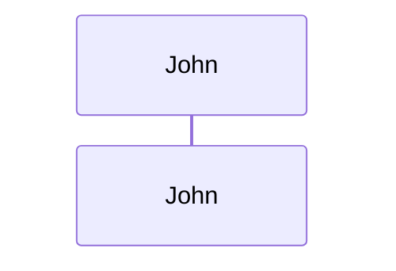
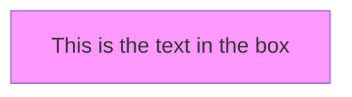
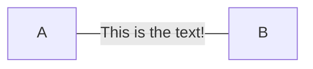

## The Markdown language

<font color=#0fb503>other color</font>

🔴 🟠 ⚫ ⚪ 🟣 🟢 🟡 🔵

`red color`
This is a paragraph that for some reason we want blue.
{: .blue}
{: .blue}

 U+1F534
```json
dsf,ldfl
```
```html
dsf,ldfl
```
```javascript
dsf,ldfl
```


---
title: Node with text
---






```html
.red{color:red;}
<p class="red">dsfsdfsd</p>


```
Markdown: Syntax
================

<ul id="ProjectSubmenu">
    <li><a href="/projects/markdown/" title="Markdown Project Page">Main</a></li>
    <li><a href="/projects/markdown/basics" title="Markdown Basics">Basics</a></li>
    <li><a class="selected" title="Markdown Syntax Documentation">Syntax</a></li>
    <li><a href="/projects/markdown/license" title="Pricing and License Information">License</a></li>
    <li><a href="/projects/markdown/dingus" title="Online Markdown Web Form">Dingus</a></li>
</ul>


*   [Overview](#overview)
    *   [Philosophy](#philosophy)
    *   [Inline HTML](#html)
    *   [Automatic Escaping for Special Characters](#autoescape)
*   [Block Elements](#block)
    *   [Paragraphs and Line Breaks](#p)
    *   [Headers](#header)
    *   [Blockquotes](#blockquote)
    *   [Lists](#list)
    *   [Code Blocks](#precode)
    *   [Horizontal Rules](#hr)
*   [Span Elements](#span)
    *   [Links](#link)
    *   [Emphasis](#em)
    *   [Code](#code)
    *   [Images](#img)
*   [Miscellaneous](#misc)
    *   [Backslash Escapes](#backslash)
    *   [Automatic Links](#autolink)


**Note:** This document is itself written using Markdown; you
can [see the source for it by adding '.text' to the URL][src].

  [src]: /projects/markdown/syntax.text

* * *

<h2 id="overview">Overview</h2>

<h3 id="philosophy">Philosophy</h3>

Markdown is intended to be as easy-to-read and easy-to-write as is feasible.

Readability, however, is emphasized above all else. A Markdown-formatted
document should be publishable as-is, as plain text, without looking
like it's been marked up with tags or formatting instructions. While
Markdown's syntax has been influenced by several existing text-to-HTML
filters -- including [Setext] [1], [atx] [2], [Textile] [3], [reStructuredText] [4],
[Grutatext] [5], and [EtText] [6] -- the single biggest source of
inspiration for Markdown's syntax is the format of plain text email.

  [1]: http://docutils.sourceforge.net/mirror/setext.html
  [2]: http://www.aaronsw.com/2002/atx/
  [3]: http://textism.com/tools/textile/
  [4]: http://docutils.sourceforge.net/rst.html
  [5]: http://www.triptico.com/software/grutatxt.html
  [6]: http://ettext.taint.org/doc/

To this end, Markdown's syntax is comprised entirely of punctuation
characters, which punctuation characters have been carefully chosen so
as to look like what they mean. E.g., asterisks around a word actually
look like \*emphasis\*. Markdown lists look like, well, lists. Even
blockquotes look like quoted passages of text, assuming you've ever
used email.


<h3 id="html">Inline HTML</h3>

Markdown's syntax is intended for one purpose: to be used as a
format for *writing* for the web.

Markdown is not a replacement for HTML, or even close to it. Its
syntax is very small, corresponding only to a very small subset of
HTML tags. The idea is *not* to create a syntax that makes it easier
to insert HTML tags. In my opinion, HTML tags are already easy to
insert. The idea for Markdown is to make it easy to read, write, and
edit prose. HTML is a *publishing* format; Markdown is a *writing*
format. Thus, Markdown's formatting syntax only addresses issues that
can be conveyed in plain text.

For any markup that is not covered by Markdown's syntax, you simply
use HTML itself. There's no need to preface it or delimit it to
indicate that you're switching from Markdown to HTML; you just use
the tags.

The only restrictions are that block-level HTML elements -- e.g. `<div>`,
`<table>`, `<pre>`, `<p>`, etc. -- must be separated from surrounding
content by blank lines, and the start and end tags of the block should
not be indented with tabs or spaces. Markdown is smart enough not
to add extra (unwanted) `<p>` tags around HTML block-level tags.

For example, to add an HTML table to a Markdown article:

    This is a regular paragraph.

    <table>
        <tr>
            <td>Foo</td>
        </tr>
    </table>

    This is another regular paragraph.

Note that Markdown formatting syntax is not processed within block-level
HTML tags. E.g., you can't use Markdown-style `*emphasis*` inside an
HTML block.

Span-level HTML tags -- e.g. `<span>`, `<cite>`, or `<del>` -- can be
used anywhere in a Markdown paragraph, list item, or header. If you
want, you can even use HTML tags instead of Markdown formatting; e.g. if
you'd prefer to use HTML `<a>` or `` tags instead of Markdown's
link or image syntax, go right ahead.

Unlike block-level HTML tags, Markdown syntax *is* processed within
span-level tags.


<h3 id="autoescape">Automatic Escaping for Special Characters</h3>

In HTML, there are two characters that demand special treatment: `<`
and `&`. Left angle brackets are used to start tags; ampersands are
used to denote HTML entities. If you want to use them as literal
characters, you must escape them as entities, e.g. `&lt;`, and
`&amp;`.

Ampersands in particular are bedeviling for web writers. If you want to
write about 'AT&T', you need to write '`AT&amp;T`'. You even need to
escape ampersands within URLs. Thus, if you want to link to:

    http://images.google.com/images?num=30&q=larry+bird

you need to encode the URL as:

    http://images.google.com/images?num=30&amp;q=larry+bird

in your anchor tag `href` attribute. Needless to say, this is easy to
forget, and is probably the single most common source of HTML validation
errors in otherwise well-marked-up web sites.

Markdown allows you to use these characters naturally, taking care of
all the necessary escaping for you. If you use an ampersand as part of
an HTML entity, it remains unchanged; otherwise it will be translated
into `&amp;`.

So, if you want to include a copyright symbol in your article, you can write:

    &copy;

and Markdown will leave it alone. But if you write:

    AT&T

Markdown will translate it to:

    AT&amp;T

Similarly, because Markdown supports [inline HTML](#html), if you use
angle brackets as delimiters for HTML tags, Markdown will treat them as
such. But if you write:

    4 < 5

Markdown will translate it to:

    4 &lt; 5

However, inside Markdown code spans and blocks, angle brackets and
ampersands are *always* encoded automatically. This makes it easy to use
Markdown to write about HTML code. (As opposed to raw HTML, which is a
terrible format for writing about HTML syntax, because every single `<`
and `&` in your example code needs to be escaped.)


* * *


<h2 id="block">Block Elements</h2>


<h3 id="p">Paragraphs and Line Breaks</h3>

A paragraph is simply one or more consecutive lines of text, separated
by one or more blank lines. (A blank line is any line that looks like a
blank line -- a line containing nothing but spaces or tabs is considered
blank.) Normal paragraphs should not be indented with spaces or tabs.

The implication of the "one or more consecutive lines of text" rule is
that Markdown supports "hard-wrapped" text paragraphs. This differs
significantly from most other text-to-HTML formatters (including Movable
Type's "Convert Line Breaks" option) which translate every line break
character in a paragraph into a `<br />` tag.

When you *do* want to insert a `<br />` break tag using Markdown, you
end a line with two or more spaces, then type return.

Yes, this takes a tad more effort to create a `<br />`, but a simplistic
"every line break is a `<br />`" rule wouldn't work for Markdown.
Markdown's email-style [blockquoting][bq] and multi-paragraph [list items][l]
work best -- and look better -- when you format them with hard breaks.

  [bq]: #blockquote
  [l]:  #list


<h3 id="header">Headers</h3>

Markdown supports two styles of headers, [Setext] [1] and [atx] [2].

Setext-style headers are "underlined" using equal signs (for first-level
headers) and dashes (for second-level headers). For example:

    This is an H1
    =============

    This is an H2
    -------------

Any number of underlining `=`'s or `-`'s will work.

Atx-style headers use 1-6 hash characters at the start of the line,
corresponding to header levels 1-6. For example:

    # This is an H1

    ## This is an H2

    ###### This is an H6

Optionally, you may "close" atx-style headers. This is purely
cosmetic -- you can use this if you think it looks better. The
closing hashes don't even need to match the number of hashes
used to open the header. (The number of opening hashes
determines the header level.) :

    # This is an H1 #

    ## This is an H2 ##

    ### This is an H3 ######


<h3 id="blockquote">Blockquotes</h3>

Markdown uses email-style `>` characters for blockquoting. If you're
familiar with quoting passages of text in an email message, then you
know how to create a blockquote in Markdown. It looks best if you hard
wrap the text and put a `>` before every line:

    > This is a blockquote with two paragraphs. Lorem ipsum dolor sit amet,
    > consectetuer adipiscing elit. Aliquam hendrerit mi posuere lectus.
    > Vestibulum enim wisi, viverra nec, fringilla in, laoreet vitae, risus.
    > 
    > Donec sit amet nisl. Aliquam semper ipsum sit amet velit. Suspendisse
    > id sem consectetuer libero luctus adipiscing.

Markdown allows you to be lazy and only put the `>` before the first
line of a hard-wrapped paragraph:

    > This is a blockquote with two paragraphs. Lorem ipsum dolor sit amet,
    consectetuer adipiscing elit. Aliquam hendrerit mi posuere lectus.
    Vestibulum enim wisi, viverra nec, fringilla in, laoreet vitae, risus.

    > Donec sit amet nisl. Aliquam semper ipsum sit amet velit. Suspendisse
    id sem consectetuer libero luctus adipiscing.

Blockquotes can be nested (i.e. a blockquote-in-a-blockquote) by
adding additional levels of `>`:

    > This is the first level of quoting.
    >
    > > This is nested blockquote.
    >
    > Back to the first level.

Blockquotes can contain other Markdown elements, including headers, lists,
and code blocks:

	> ## This is a header.
	> 
	> 1.   This is the first list item.
	> 2.   This is the second list item.
	> 
	> Here's some example code:
	> 
	>     return shell_exec("echo $input | $markdown_script");

Any decent text editor should make email-style quoting easy. For
example, with BBEdit, you can make a selection and choose Increase
Quote Level from the Text menu.


<h3 id="list">Lists</h3>

Markdown supports ordered (numbered) and unordered (bulleted) lists.

Unordered lists use asterisks, pluses, and hyphens -- interchangably
-- as list markers:

    *   Red
    *   Green
    *   Blue

is equivalent to:

    +   Red
    +   Green
    +   Blue

and:

    -   Red
    -   Green
    -   Blue

Ordered lists use numbers followed by periods:

    1.  Bird
    2.  McHale
    3.  Parish

It's important to note that the actual numbers you use to mark the
list have no effect on the HTML output Markdown produces. The HTML
Markdown produces from the above list is:

    <ol>
    <li>Bird</li>
    <li>McHale</li>
    <li>Parish</li>
    </ol>

If you instead wrote the list in Markdown like this:

    1.  Bird
    1.  McHale
    1.  Parish

or even:

    3. Bird
    1. McHale
    8. Parish

you'd get the exact same HTML output. The point is, if you want to,
you can use ordinal numbers in your ordered Markdown lists, so that
the numbers in your source match the numbers in your published HTML.
But if you want to be lazy, you don't have to.

If you do use lazy list numbering, however, you should still start the
list with the number 1. At some point in the future, Markdown may support
starting ordered lists at an arbitrary number.

List markers typically start at the left margin, but may be indented by
up to three spaces. List markers must be followed by one or more spaces
or a tab.

To make lists look nice, you can wrap items with hanging indents:

    *   Lorem ipsum dolor sit amet, consectetuer adipiscing elit.
        Aliquam hendrerit mi posuere lectus. Vestibulum enim wisi,
        viverra nec, fringilla in, laoreet vitae, risus.
    *   Donec sit amet nisl. Aliquam semper ipsum sit amet velit.
        Suspendisse id sem consectetuer libero luctus adipiscing.

But if you want to be lazy, you don't have to:

    *   Lorem ipsum dolor sit amet, consectetuer adipiscing elit.
    Aliquam hendrerit mi posuere lectus. Vestibulum enim wisi,
    viverra nec, fringilla in, laoreet vitae, risus.
    *   Donec sit amet nisl. Aliquam semper ipsum sit amet velit.
    Suspendisse id sem consectetuer libero luctus adipiscing.

If list items are separated by blank lines, Markdown will wrap the
items in `<p>` tags in the HTML output. For example, this input:

    *   Bird
    *   Magic

will turn into:

    <ul>
    <li>Bird</li>
    <li>Magic</li>
    </ul>

But this:

    *   Bird

    *   Magic

will turn into:

    <ul>
    <li><p>Bird</p></li>
    <li><p>Magic</p></li>
    </ul>

List items may consist of multiple paragraphs. Each subsequent
paragraph in a list item must be indented by either 4 spaces
or one tab:

    1.  This is a list item with two paragraphs. Lorem ipsum dolor
        sit amet, consectetuer adipiscing elit. Aliquam hendrerit
        mi posuere lectus.

        Vestibulum enim wisi, viverra nec, fringilla in, laoreet
        vitae, risus. Donec sit amet nisl. Aliquam semper ipsum
        sit amet velit.

    2.  Suspendisse id sem consectetuer libero luctus adipiscing.

It looks nice if you indent every line of the subsequent
paragraphs, but here again, Markdown will allow you to be
lazy:

    *   This is a list item with two paragraphs.

        This is the second paragraph in the list item. You're
    only required to indent the first line. Lorem ipsum dolor
    sit amet, consectetuer adipiscing elit.

    *   Another item in the same list.

To put a blockquote within a list item, the blockquote's `>`
delimiters need to be indented:

    *   A list item with a blockquote:

        > This is a blockquote
        > inside a list item.

To put a code block within a list item, the code block needs
to be indented *twice* -- 8 spaces or two tabs:

    *   A list item with a code block:

            <code goes here>


It's worth noting that it's possible to trigger an ordered list by
accident, by writing something like this:

    1986. What a great season.

In other words, a *number-period-space* sequence at the beginning of a
line. To avoid this, you can backslash-escape the period:

    1986\. What a great season.


<h3 id="precode">Code Blocks</h3>

Pre-formatted code blocks are used for writing about programming or
markup source code. Rather than forming normal paragraphs, the lines
of a code block are interpreted literally. Markdown wraps a code block
in both `<pre>` and `<code>` tags.

To produce a code block in Markdown, simply indent every line of the
block by at least 4 spaces or 1 tab. For example, given this input:

    This is a normal paragraph:

        This is a code block.

Markdown will generate:

    <p>This is a normal paragraph:</p>

    <pre><code>This is a code block.
    </code></pre>

One level of indentation -- 4 spaces or 1 tab -- is removed from each
line of the code block. For example, this:

    Here is an example of AppleScript:

        tell application "Foo"
            beep
        end tell

will turn into:

    <p>Here is an example of AppleScript:</p>

    <pre><code>tell application "Foo"
        beep
    end tell
    </code></pre>

A code block continues until it reaches a line that is not indented
(or the end of the article).

Within a code block, ampersands (`&`) and angle brackets (`<` and `>`)
are automatically converted into HTML entities. This makes it very
easy to include example HTML source code using Markdown -- just paste
it and indent it, and Markdown will handle the hassle of encoding the
ampersands and angle brackets. For example, this:

        <div class="footer">
            &copy; 2004 Foo Corporation
        </div>

will turn into:

    <pre><code>&lt;div class="footer"&gt;
        &amp;copy; 2004 Foo Corporation
    &lt;/div&gt;
    </code></pre>

Regular Markdown syntax is not processed within code blocks. E.g.,
asterisks are just literal asterisks within a code block. This means
it's also easy to use Markdown to write about Markdown's own syntax.


<h3 id="hr">Horizontal Rules</h3>

You can produce a horizontal rule tag (`<hr />`) by placing three or
more hyphens, asterisks, or underscores on a line by themselves. If you
wish, you may use spaces between the hyphens or asterisks. Each of the
following lines will produce a horizontal rule:

    * * *

    ***

    *****

    - - -

    ---------------------------------------


* * *

<h2 id="span">Span Elements</h2>

<h3 id="link">Links</h3>

Markdown supports two style of links: *inline* and *reference*.

In both styles, the link text is delimited by [square brackets].

To create an inline link, use a set of regular parentheses immediately
after the link text's closing square bracket. Inside the parentheses,
put the URL where you want the link to point, along with an *optional*
title for the link, surrounded in quotes. For example:

    This is [an example](http://example.com/ "Title") inline link.

    [This link](http://example.net/) has no title attribute.

Will produce:

    <p>This is <a href="http://example.com/" title="Title">
    an example</a> inline link.</p>

    <p><a href="http://example.net/">This link</a> has no
    title attribute.</p>

If you're referring to a local resource on the same server, you can
use relative paths:

    See my [About](/about/) page for details.   

Reference-style links use a second set of square brackets, inside
which you place a label of your choosing to identify the link:

    This is [an example][id] reference-style link.

You can optionally use a space to separate the sets of brackets:

    This is [an example] [id] reference-style link.

Then, anywhere in the document, you define your link label like this,
on a line by itself:

    [id]: http://example.com/  "Optional Title Here"

That is:

*   Square brackets containing the link identifier (optionally
    indented from the left margin using up to three spaces);
*   followed by a colon;
*   followed by one or more spaces (or tabs);
*   followed by the URL for the link;
*   optionally followed by a title attribute for the link, enclosed
    in double or single quotes, or enclosed in parentheses.

The following three link definitions are equivalent:

	[foo]: http://example.com/  "Optional Title Here"
	[foo]: http://example.com/  'Optional Title Here'
	[foo]: http://example.com/  (Optional Title Here)

**Note:** There is a known bug in Markdown.pl 1.0.1 which prevents
single quotes from being used to delimit link titles.

The link URL may, optionally, be surrounded by angle brackets:

    [id]: <http://example.com/>  "Optional Title Here"

You can put the title attribute on the next line and use extra spaces
or tabs for padding, which tends to look better with longer URLs:

    [id]: http://example.com/longish/path/to/resource/here
        "Optional Title Here"

Link definitions are only used for creating links during Markdown
processing, and are stripped from your document in the HTML output.

Link definition names may consist of letters, numbers, spaces, and
punctuation -- but they are *not* case sensitive. E.g. these two
links:

	[link text][a]
	[link text][A]

are equivalent.

The *implicit link name* shortcut allows you to omit the name of the
link, in which case the link text itself is used as the name.
Just use an empty set of square brackets -- e.g., to link the word
"Google" to the google.com web site, you could simply write:

	[Google][]

And then define the link:

	[Google]: http://google.com/

Because link names may contain spaces, this shortcut even works for
multiple words in the link text:

	Visit [Daring Fireball][] for more information.

And then define the link:
	
	[Daring Fireball]: http://daringfireball.net/

Link definitions can be placed anywhere in your Markdown document. I
tend to put them immediately after each paragraph in which they're
used, but if you want, you can put them all at the end of your
document, sort of like footnotes.

Here's an example of reference links in action:

    I get 10 times more traffic from [Google] [1] than from
    [Yahoo] [2] or [MSN] [3].

      [1]: http://google.com/        "Google"
      [2]: http://search.yahoo.com/  "Yahoo Search"
      [3]: http://search.msn.com/    "MSN Search"

Using the implicit link name shortcut, you could instead write:

    I get 10 times more traffic from [Google][] than from
    [Yahoo][] or [MSN][].

      [google]: http://google.com/        "Google"
      [yahoo]:  http://search.yahoo.com/  "Yahoo Search"
      [msn]:    http://search.msn.com/    "MSN Search"

Both of the above examples will produce the following HTML output:

    <p>I get 10 times more traffic from <a href="http://google.com/"
    title="Google">Google</a> than from
    <a href="http://search.yahoo.com/" title="Yahoo Search">Yahoo</a>
    or <a href="http://search.msn.com/" title="MSN Search">MSN</a>.</p>

For comparison, here is the same paragraph written using
Markdown's inline link style:

    I get 10 times more traffic from [Google](http://google.com/ "Google")
    than from [Yahoo](http://search.yahoo.com/ "Yahoo Search") or
    [MSN](http://search.msn.com/ "MSN Search").

The point of reference-style links is not that they're easier to
write. The point is that with reference-style links, your document
source is vastly more readable. Compare the above examples: using
reference-style links, the paragraph itself is only 81 characters
long; with inline-style links, it's 176 characters; and as raw HTML,
it's 234 characters. In the raw HTML, there's more markup than there
is text.

With Markdown's reference-style links, a source document much more
closely resembles the final output, as rendered in a browser. By
allowing you to move the markup-related metadata out of the paragraph,
you can add links without interrupting the narrative flow of your
prose.


<h3 id="em">Emphasis</h3>

Markdown treats asterisks (`*`) and underscores (`_`) as indicators of
emphasis. Text wrapped with one `*` or `_` will be wrapped with an
HTML `<em>` tag; double `*`'s or `_`'s will be wrapped with an HTML
`<strong>` tag. E.g., this input:

    *single asterisks*

    _single underscores_

    **double asterisks**

    __double underscores__

will produce:

    <em>single asterisks</em>

    <em>single underscores</em>

    <strong>double asterisks</strong>

    <strong>double underscores</strong>

You can use whichever style you prefer; the lone restriction is that
the same character must be used to open and close an emphasis span.

Emphasis can be used in the middle of a word:

    un*frigging*believable

But if you surround an `*` or `_` with spaces, it'll be treated as a
literal asterisk or underscore.

To produce a literal asterisk or underscore at a position where it
would otherwise be used as an emphasis delimiter, you can backslash
escape it:

    \*this text is surrounded by literal asterisks\*


<h3 id="code">Code</h3>

To indicate a span of code, wrap it with backtick quotes (`` ` ``).
Unlike a pre-formatted code block, a code span indicates code within a
normal paragraph. For example:

    Use the `printf()` function.

will produce:

    <p>Use the <code>printf()</code> function.</p>

To include a literal backtick character within a code span, you can use
multiple backticks as the opening and closing delimiters:

    ``There is a literal backtick (`) here.``

which will produce this:

    <p><code>There is a literal backtick (`) here.</code></p>

The backtick delimiters surrounding a code span may include spaces --
one after the opening, one before the closing. This allows you to place
literal backtick characters at the beginning or end of a code span:

	A single backtick in a code span: `` ` ``
	
	A backtick-delimited string in a code span: `` `foo` ``

will produce:

	<p>A single backtick in a code span: <code>`</code></p>
	
	<p>A backtick-delimited string in a code span: <code>`foo`</code></p>

With a code span, ampersands and angle brackets are encoded as HTML
entities automatically, which makes it easy to include example HTML
tags. Markdown will turn this:

    Please don't use any `<blink>` tags.

into:

    <p>Please don't use any <code>&lt;blink&gt;</code> tags.</p>

You can write this:

    `&#8212;` is the decimal-encoded equivalent of `&mdash;`.

to produce:

    <p><code>&amp;#8212;</code> is the decimal-encoded
    equivalent of <code>&amp;mdash;</code>.</p>


<h3 id="img">Images</h3>

Admittedly, it's fairly difficult to devise a "natural" syntax for
placing images into a plain text document format.

Markdown uses an image syntax that is intended to resemble the syntax
for links, allowing for two styles: *inline* and *reference*.

Inline image syntax looks like this:

    

    

That is:

*   An exclamation mark: `!`;
*   followed by a set of square brackets, containing the `alt`
    attribute text for the image;
*   followed by a set of parentheses, containing the URL or path to
    the image, and an optional `title` attribute enclosed in double
    or single quotes.

Reference-style image syntax looks like this:

    ![Alt text][id]

Where "id" is the name of a defined image reference. Image references
are defined using syntax identical to link references:

    [id]: url/to/image  "Optional title attribute"

As of this writing, Markdown has no syntax for specifying the
dimensions of an image; if this is important to you, you can simply
use regular HTML `` tags.


* * *


<h2 id="misc">Miscellaneous</h2>

<h3 id="autolink">Automatic Links</h3>

Markdown supports a shortcut style for creating "automatic" links for URLs and email addresses: simply surround the URL or email address with angle brackets. What this means is that if you want to show the actual text of a URL or email address, and also have it be a clickable link, you can do this:

    <http://example.com/>
    
Markdown will turn this into:

    <a href="http://example.com/">http://example.com/</a>

Automatic links for email addresses work similarly, except that
Markdown will also perform a bit of randomized decimal and hex
entity-encoding to help obscure your address from address-harvesting
spambots. For example, Markdown will turn this:

    <address@example.com>

into something like this:

    <a href="&#x6D;&#x61;i&#x6C;&#x74;&#x6F;:&#x61;&#x64;&#x64;&#x72;&#x65;
    &#115;&#115;&#64;&#101;&#120;&#x61;&#109;&#x70;&#x6C;e&#x2E;&#99;&#111;
    &#109;">&#x61;&#x64;&#x64;&#x72;&#x65;&#115;&#115;&#64;&#101;&#120;&#x61;
    &#109;&#x70;&#x6C;e&#x2E;&#99;&#111;&#109;</a>

which will render in a browser as a clickable link to "address@example.com".

(This sort of entity-encoding trick will indeed fool many, if not
most, address-harvesting bots, but it definitely won't fool all of
them. It's better than nothing, but an address published in this way
will probably eventually start receiving spam.)


<h3 id="backslash">Backslash Escapes</h3>

Markdown allows you to use backslash escapes to generate literal
characters which would otherwise have special meaning in Markdown's
formatting syntax. For example, if you wanted to surround a word
with literal asterisks (instead of an HTML `<em>` tag), you can use
backslashes before the asterisks, like this:

    \*literal asterisks\*

Markdown provides backslash escapes for the following characters:

    \   backslash
    `   backtick
    *   asterisk
    _   underscore
    {}  curly braces
    []  square brackets
    ()  parentheses
    #   hash mark
	+	plus sign
	-	minus sign (hyphen)
    .   dot
    !   exclamation mark

-  `#f03c15`
-  `#c5f015`
-  `#1589F0`

## A header with an id  ##  {: #the-head}
// => <h2 id="the-head">A header with an id</h2>

[a special url](/my-special-place.html){: .special}
// => <a href="/my-special-place.html" class="special">a special url</a>

A paragraph with a random attribute
{: random=attribute}
// => <p random="attribute">A paragraph with a random attribute</p>

```json
   #f03c15
   {
"color":"red"   }
   
```
```html
 \\#1589F0
<div style="background-color:rgba(0, 0, 0, 0.0470588); text-align:center; vertical-align: middle; padding:40px 0; margin-top:30px">
<a href="/blog">VIEW THE BLOG</a>
</div>
```
```js
   // code for coloring
```
```css
   // code for coloring
```
// etc.
<mark>Marked text</mark>

<div style="background-color:rgba(0, 0, 0, 0.0470588); text-align:center; vertical-align: middle; padding:40px 0;">
DONATE
</div>

<div style="background-color:rgba(0, 0, 0, 0.0470588); text-align:center; vertical-align: middle; padding:40px 0; margin-top:30px">
<a href="/blog">VIEW THE BLOG</a>
</div>


==highlight== 

<code> <i>This text will be italic</i> <b style="color:red;">this text will be bold</b> <font color="#009900" face="Verdana" size="6">font</font></code>
```html
<span style="color:red">The Markdown language</span>
```
Markdown is a lightweight markup language --------that you can===== use to add **formatting** elements to plain text documents. Created by [John Gruber](https://daringfireball.net/projects/markdown/) in ~2003~2004, Markdown is now one of the world’s most popular markup languages.
hotelImg2.png

---
$\mathcal{\color{purple}{this \ is \ a \ paragraph} \ \color{cyan}{in \ another \ font}}$


 
## Editing with Markdown output

The [CKEditor 5 WYSIWYG](https://ckeditor.com/) editor lets you use this flexible yet simple markup language in the GitHub flavor. The editor-produced Markdown output supports the most important features, like [links](https://ckeditor.com/), **different** kinds of _emphasis_, `inline code formatting` or code blocks:

```css
p {
text-align: center;
color: red;
}
```
Some Markdown text with <span style="color:#ffffff">some *blue* text</span>
<style>
r { color: Red }
o { color: Orange }
g { color: Green }
</style>
**My Bold Text, in red color.**{: style="color: red; opacity: 0.80;" }


# TODOs:

- <r>TODO:</r> Important thing to do
- <o>TODO:</o> Less important thing to do
- <g>DONE:</g> Breath deeply and improve karma
## Formatting blocks with Markdown


🔴🟠🟡🟢🔵🟣🟤⚫⚪🔘🛑⭕

🟥🟧🟨🟩🟦🟪🟫⬛⬜🔲🔳⏹☑✅❎

❤️🧡💛💚💜💙🤎🖤🤍♥️💔💖💘💝💗💓💟💕❣️♡

🔺🔻🔷🔶🔹🔸♦💠💎💧🧊

🏴🏳🚩🏁

◻️◼️◾️◽️▪️▫️
Markdown can be used to create various block-level features, such as:

* Block quotes
* Headings
1. Heading 1
2. Heading 2
3. Heading 3
* Lists, including nested ones
* Numbered lists
* Bulleted lists
* To-do lists
```diff
- Bear in mind that Markdown has only very basic support for tables, 
so things like table styles or merged cells will not work.Bear in mind that 
Markdown has only very basic support for tables, so things like table styles or
merged cells will not work.Bear in mind that Markdown has only very basic support for tables, so things like table styles or merged cells will not work.Bear in mind that Markdown has only very basic support for tables, so things l
ike table styles or merged cells will not work.
+ text in yellow
! text in orange
# text in gray
@@ text in purple (and bold)@@
```
## Support for tables in Markdown


Bear in mind that Markdown has only very basic support for tables, so things like table styles or merged cells will not work.

|   | Income | Revenue |
| --- | --- | --- |

| Walker 3 | $104.000 | 15% |
| Stroller | $12.000 | 10% |
| Runner | $97.500 | 15% |
